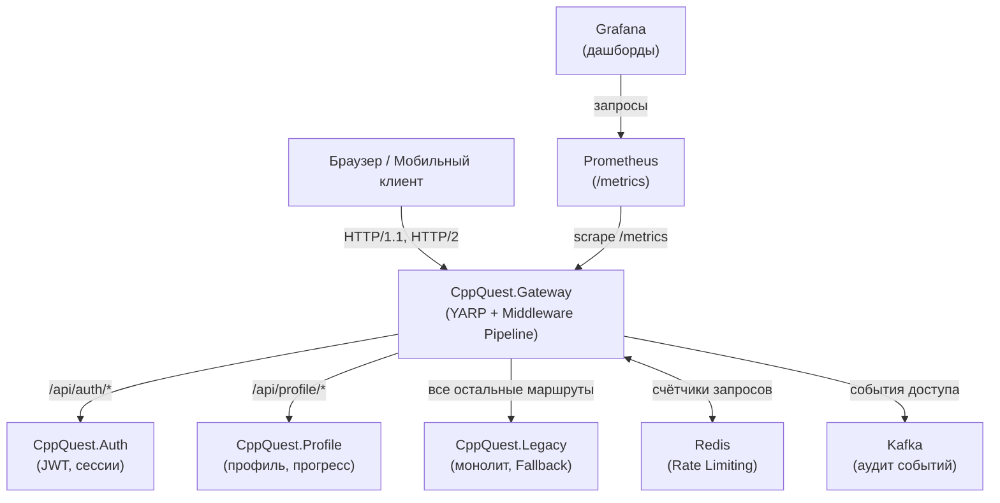
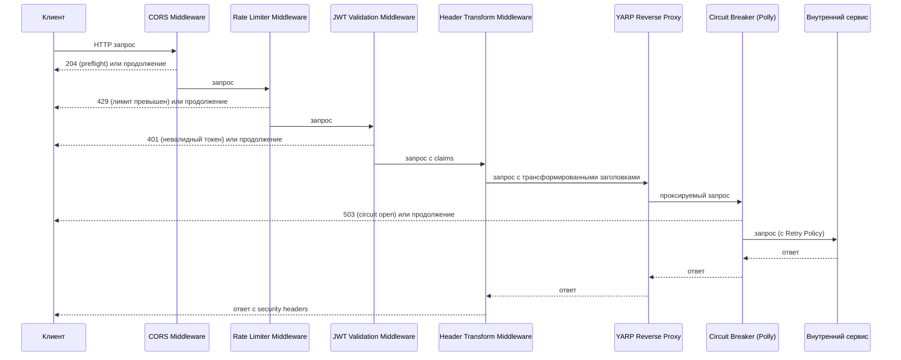

# Технический дизайн: CppQuest API Gateway

## Обзор

CppQuest API Gateway — это интеллектуальный слой маршрутизации на базе YARP (.NET 8), реализующий паттерн Strangler Fig для постепенной миграции монолитной системы CppQuest в микросервисную архитектуру. Gateway является единственной точкой входа для всех клиентских HTTP-запросов и берёт на себя сквозные задачи: безопасность, отказоустойчивость, наблюдаемость и управление трафиком.

### Ключевые цели дизайна

- Единая точка входа с поддержкой HTTP/1.1 и HTTP/2
- Централизованная JWT-валидация без обращения к Auth_Service при каждом запросе
- Распределённый Rate Limiting через Redis
- Отказоустойчивость через Polly (Retry + Circuit Breaker)
- Метрики по паттерну RED через Prometheus/Grafana
- Аудит событий через Kafka (асинхронно, без блокировки)
- Hot Reload конфигурации маршрутов без перезапуска процесса

---

## Архитектура

### Общая топология



### Конвейер обработки запроса (Middleware Pipeline)

Порядок Middleware в ASP.NET Core конвейере критичен. Каждый запрос проходит следующие слои:



### Паттерн Strangler Fig

Gateway реализует постепенную миграцию через приоритет маршрутов:
1. Специфичные маршруты микросервисов (`/api/auth/*`, `/api/profile/*`) имеют высший приоритет
2. Все остальные запросы падают на Legacy как Fallback-маршрут
3. По мере экстракции новых сервисов добавляются новые маршруты без изменения Legacy

---

## Компоненты и интерфейсы

### 1. YARP Reverse Proxy (ядро маршрутизации)

**Библиотека:** `Yarp.ReverseProxy` (Microsoft)

**Конфигурация** загружается из `appsettings.json` и поддерживает Hot Reload через `IOptionsMonitor<T>`:

```json
{
  "ReverseProxy": {
    "Routes": {
      "auth-route": {
        "ClusterId": "auth-cluster",
        "Match": { "Path": "/api/auth/{**catch-all}" }
      },
      "profile-route": {
        "ClusterId": "profile-cluster",
        "Match": { "Path": "/api/profile/{**catch-all}" }
      },
      "legacy-fallback": {
        "ClusterId": "legacy-cluster",
        "Match": { "Path": "{**catch-all}" }
      }
    },
    "Clusters": {
      "auth-cluster": {
        "Destinations": {
          "auth-primary": { "Address": "http://auth-service:8080/" }
        }
      },
      "profile-cluster": {
        "Destinations": {
          "profile-primary": { "Address": "http://profile-service:8080/" }
        }
      },
      "legacy-cluster": {
        "Destinations": {
          "legacy-primary": { "Address": "http://legacy-service:5000/" }
        }
      }
    }
  }
}
```

**Hot Reload** реализуется через `IReverseProxyBuilder.LoadFromConfig()` с `IOptionsMonitor`, который автоматически перезагружает конфигурацию при изменении файла.

### 2. JWT Validation Middleware

**Интерфейс:**

```csharp
public interface IJwtValidator
{
    JwtValidationResult Validate(string token);
}

public record JwtValidationResult(
    bool IsValid,
    string? UserId,
    IReadOnlyDictionary<string, string>? Claims,
    string? FailureReason
);
```

**Логика:**
- Загружает публичный ключ RSA из конфигурации при старте (без обращения к Auth_Service)
- Проверяет подпись, срок действия, issuer и audience
- При успехе добавляет claims в `HttpContext.Items` для последующих Middleware
- При неудаче публикует событие в Kafka и возвращает 401

### 3. Rate Limiter Middleware

**Алгоритм:** Sliding Window (скользящее окно) через Redis

**Интерфейс:**

```csharp
public interface IRateLimiterService
{
    Task<RateLimitResult> CheckLimitAsync(string key, RateLimitPolicy policy);
}

public record RateLimitResult(
    bool IsAllowed,
    int RetryAfterSeconds,
    int RemainingRequests
);

public record RateLimitPolicy(
    int MaxRequests,
    TimeSpan Window
);
```

**Ключи Redis:**
- По IP: `rl:ip:{ip_address}:{window_timestamp}`
- По UserID: `rl:user:{user_id}:{window_timestamp}`

**Конфигурация политик:**

```json
{
  "RateLimiting": {
    "DefaultPolicy": { "MaxRequests": 100, "WindowSeconds": 60 },
    "AuthenticatedPolicy": { "MaxRequests": 300, "WindowSeconds": 60 },
    "PublicRoutePolicy": { "MaxRequests": 500, "WindowSeconds": 60 }
  }
}
```

### 4. Header Transformation Middleware

**Входящие трансформации (запрос → внутренний сервис):**
- Добавить `X-Forwarded-For: {client_ip}`
- Удалить `Authorization` заголовок
- Добавить `X-User-Id: {user_id}` (из JWT claims)
- Добавить `X-User-Claims: {base64_encoded_claims}` (из JWT claims)

**Исходящие трансформации (ответ → клиент):**
- Добавить `Strict-Transport-Security: max-age=31536000; includeSubDomains`
- Добавить `X-Content-Type-Options: nosniff`
- Добавить `Content-Security-Policy: default-src 'self'`
- Удалить `Server`, `X-Powered-By`, `X-AspNet-Version`

### 5. Circuit Breaker и Retry (Polly)

**Библиотека:** `Microsoft.Extensions.Http.Resilience` (Polly v8)

**Конфигурация через `ResiliencePipelineBuilder`:**

```csharp
// Retry Policy
new RetryStrategyOptions
{
    MaxRetryAttempts = 3,
    BackoffType = DelayBackoffType.Exponential,
    Delay = TimeSpan.FromMilliseconds(200),
    ShouldHandle = new PredicateBuilder().Handle<HttpRequestException>()
}

// Circuit Breaker
new CircuitBreakerStrategyOptions
{
    FailureRatio = 0.5,
    MinimumThroughput = 5,
    SamplingDuration = TimeSpan.FromSeconds(30),
    BreakDuration = TimeSpan.FromSeconds(10),
    HalfOpenMaxAttempts = 1 // пробный запрос каждые 10 секунд
}
```

**Состояния Circuit Breaker:**
- `Closed` — нормальная работа
- `Open` — возврат 503 без обращения к сервису
- `HalfOpen` — один пробный запрос для проверки восстановления

### 6. Metrics Middleware (Prometheus)

**Библиотека:** `prometheus-net.AspNetCore`

**Экспортируемые метрики:**

```csharp
// Rate
Counter gateway_requests_total { route, method, status_code }

// Duration
Histogram gateway_request_duration_seconds { route, method }
    Buckets: [0.01, 0.05, 0.1, 0.25, 0.5, 1.0, 2.5, 5.0]

// Errors
Counter gateway_errors_total { route, error_type }

// Circuit Breaker state
Gauge circuit_breaker_state { service }
    Values: 0=Closed, 1=Open, 2=HalfOpen
```

### 7. Kafka Audit Publisher

**Библиотека:** `Confluent.Kafka`

**Интерфейс:**

```csharp
public interface IAuditEventPublisher
{
    ValueTask PublishAccessEventAsync(AccessAuditEvent evt);
    ValueTask PublishSecurityEventAsync(SecurityAuditEvent evt);
}
```

**Асинхронная публикация** реализуется через `Channel<T>` (in-memory очередь):
- Middleware записывает событие в `Channel` (non-blocking)
- Фоновый `IHostedService` читает из `Channel` и публикует в Kafka
- При недоступности Kafka события накапливаются в `Channel` (ограниченный буфер)

### 8. CORS Middleware

**Конфигурация:**

```json
{
  "Cors": {
    "AllowedOrigins": [
      "https://cppquest.ru",
      "https://www.cppquest.ru"
    ]
  }
}
```

Список доменов загружается через `IOptionsMonitor` с поддержкой Hot Reload.

---

## Модели данных

### Конфигурационные модели

```csharp
public record GatewayConfiguration
{
    public ReverseProxyConfig ReverseProxy { get; init; }
    public RateLimitingConfig RateLimiting { get; init; }
    public JwtConfig Jwt { get; init; }
    public CorsConfig Cors { get; init; }
    public KafkaConfig Kafka { get; init; }
}

public record JwtConfig
{
    public string PublicKeyPath { get; init; }
    public string Issuer { get; init; }
    public string Audience { get; init; }
}

public record RateLimitingConfig
{
    public RateLimitPolicy DefaultPolicy { get; init; }
    public RateLimitPolicy AuthenticatedPolicy { get; init; }
    public RateLimitPolicy PublicRoutePolicy { get; init; }
}

public record RateLimitPolicy
{
    public int MaxRequests { get; init; }
    public int WindowSeconds { get; init; }
}

public record CorsConfig
{
    public string[] AllowedOrigins { get; init; }
}

public record KafkaConfig
{
    public string BootstrapServers { get; init; }
    public string AccessEventsTopic { get; init; }
    public string SecurityEventsTopic { get; init; }
    public int LocalBufferCapacity { get; init; }
}
```

### Модели событий аудита

```csharp
public record AccessAuditEvent
{
    public DateTimeOffset Timestamp { get; init; }
    public string ClientIp { get; init; }
    public string? UserId { get; init; }
    public string Route { get; init; }
    public string Method { get; init; }
    public int StatusCode { get; init; }
    public long DurationMs { get; init; }
}

public record SecurityAuditEvent
{
    public DateTimeOffset Timestamp { get; init; }
    public string ClientIp { get; init; }
    public string FailureReason { get; init; }
}
```

### Модель результата Rate Limiting

```csharp
public record RateLimitResult(
    bool IsAllowed,
    int RetryAfterSeconds,
    int RemainingRequests
);
```

### Модель результата JWT-валидации

```csharp
public record JwtValidationResult(
    bool IsValid,
    string? UserId,
    IReadOnlyDictionary<string, string>? Claims,
    string? FailureReason
);
```

---

## Свойства корректности

*Свойство — это характеристика или поведение, которое должно выполняться при всех допустимых выполнениях системы. По сути, это формальное утверждение о том, что система должна делать. Свойства служат мостом между читаемыми человеком спецификациями и машинно-верифицируемыми гарантиями корректности.*

---

### Свойство 1: Маршрутизация сохраняет метод, путь и тело запроса

*Для любого* HTTP-запроса (с произвольным методом, путём и телом), направленного на маршрут Auth_Service или Profile_Service, проксируемый запрос, полученный внутренним сервисом, должен содержать идентичные метод, путь и тело.

**Validates: Requirements 1.2, 1.3**

---

### Свойство 2: Fallback-маршрутизация на Legacy

*Для любого* HTTP-запроса с путём, не совпадающим ни с одним зарегистрированным маршрутом микросервисов, Gateway должен перенаправить запрос в Legacy-сервис.

**Validates: Requirements 1.4**

---

### Свойство 3: Round-trip конфигурации маршрутизации

*Для любой* валидной конфигурации маршрутизации (`GatewayConfiguration`), сериализация в JSON и последующая десериализация должны производить объект, эквивалентный исходному.

**Validates: Requirements 1.5, 11.4**

---

### Свойство 4: Трансформация заголовков при проксировании

*Для любого* проксируемого запроса с произвольным IP-адресом клиента и JWT-токеном:
- заголовок `X-Forwarded-For` должен содержать IP-адрес клиента
- заголовок `Authorization` должен отсутствовать
- заголовок `X-User-Id` должен содержать UserId из JWT

**Validates: Requirements 2.1, 2.2**

---

### Свойство 5: Security-заголовки присутствуют во всех ответах

*Для любого* ответа клиенту, независимо от маршрута и статус-кода, ответ должен содержать заголовки `Strict-Transport-Security`, `X-Content-Type-Options` и `Content-Security-Policy`, и не должен содержать заголовки `Server` и `X-Powered-By`.

**Validates: Requirements 2.3, 2.4**

---

### Свойство 6: Невалидный JWT возвращает 401 и не проксирует запрос

*Для любого* запроса на защищённый маршрут, где JWT отсутствует, имеет недействительную подпись или истёкший срок действия, Gateway должен вернуть статус 401, и внутренний сервис не должен получить ни одного запроса.

**Validates: Requirements 3.1, 3.2, 3.3**

---

### Свойство 7: Claims из валидного JWT передаются во внутренний сервис

*Для любого* запроса с валидным JWT, содержащим произвольный набор claims, внутренний сервис должен получить запрос с заголовком `X-User-Id`, соответствующим `sub`-claim токена.

**Validates: Requirements 3.4**

---

### Свойство 8: Превышение лимита запросов возвращает 429 с заголовком Retry-After

*Для любого* IP-адреса или UserID, отправившего количество запросов, превышающее установленный лимит в скользящем окне, все последующие запросы должны получать ответ со статусом 429, содержащий заголовок `Retry-After` с положительным целым числом секунд.

**Validates: Requirements 4.1, 4.2, 4.4**

---

### Свойство 9: Retry Policy выполняет не более 3 повторных попыток

*Для любого* запроса к внутреннему сервису, завершающегося сетевой ошибкой, количество попыток обращения к сервису должно быть не более 4 (1 исходная + 3 повторных).

**Validates: Requirements 5.2**

---

### Свойство 10: Circuit Breaker переходит в Open после порогового числа ошибок

*Для любого* внутреннего сервиса, генерирующего 5 и более последовательных ошибок в течение 30 секунд, Circuit Breaker должен перейти в состояние Open, и все последующие запросы к этому сервису должны немедленно получать ответ 503 без обращения к сервису.

**Validates: Requirements 5.3**

---

### Свойство 11: Round-trip состояния Circuit Breaker (Open → Closed)

*Для любого* Circuit Breaker в состоянии Open, успешный пробный запрос должен перевести его в состояние Closed, после чего запросы снова должны проксироваться к сервису.

**Validates: Requirements 5.5**

---

### Свойство 12: Fallback при недоступном сервисе

*Для любого* маршрута с определённым Fallback, при недоступности целевого сервиса запрос должен быть перенаправлен на Legacy, а не возвращать ошибку клиенту.

**Validates: Requirements 5.6**

---

### Свойство 13: Метрики RED корректно обновляются для каждого запроса

*Для любого* запроса через Gateway, после его завершения метрики `gateway_requests_total` и `gateway_request_duration_seconds` должны содержать запись с корректными метками `route`, `method` и `status_code`. Для ответов 4xx/5xx дополнительно должна обновляться метрика `gateway_errors_total`.

**Validates: Requirements 6.1, 6.2, 6.3**

---

### Свойство 14: Состояние Circuit Breaker отражается в метрике

*Для любого* внутреннего сервиса, при изменении состояния Circuit Breaker (Closed/Open/HalfOpen), метрика `circuit_breaker_state` с меткой `service` должна немедленно отражать новое состояние.

**Validates: Requirements 6.5**

---

### Свойство 15: Событие аудита содержит все обязательные поля

*Для любого* успешно проксированного запроса, опубликованное событие в топик `gateway.access.events` должно содержать все поля: `timestamp`, `client_ip`, `user_id`, `route`, `method`, `status_code`, `duration_ms`.

**Validates: Requirements 7.1**

---

### Свойство 16: Событие безопасности публикуется при неудачной JWT-валидации

*Для любого* запроса с невалидным JWT, опубликованное событие в топик `gateway.security.events` должно содержать поля `timestamp`, `client_ip` и `failure_reason`.

**Validates: Requirements 7.2**

---

### Свойство 17: CORS — доверенный Origin получает корректные заголовки

*Для любого* preflight OPTIONS-запроса с заголовком `Origin`, входящим в список доверенных доменов, ответ должен иметь статус 204 и содержать заголовок `Access-Control-Allow-Origin`.

**Validates: Requirements 8.1**

---

### Свойство 18: CORS — недоверенный Origin не получает CORS-заголовки

*Для любого* запроса с заголовком `Origin`, не входящим в список доверенных доменов, ответ не должен содержать заголовок `Access-Control-Allow-Origin`.

**Validates: Requirements 8.2**

---

## Обработка ошибок

### Стратегия обработки ошибок по слоям

| Слой | Ошибка | Действие | Статус |
|------|--------|----------|--------|
| CORS | Недоверенный Origin | Ответ без CORS-заголовков | 200/4xx (без CORS) |
| Rate Limiter | Превышение лимита | Ответ с `Retry-After` | 429 |
| JWT Validation | Отсутствует токен | Ответ без проксирования | 401 |
| JWT Validation | Невалидная подпись | Ответ без проксирования + Kafka event | 401 |
| JWT Validation | Истёкший токен | Ответ без проксирования + Kafka event | 401 |
| Circuit Breaker | Состояние Open | Немедленный ответ без обращения к сервису | 503 |
| Timeout | Сервис не отвечает 3 сек | Прерывание соединения | 504 |
| Retry | Сетевая ошибка (≤3 попыток) | Повтор с экспоненциальной задержкой | — |
| Retry | Сетевая ошибка (>3 попыток) | Возврат ошибки клиенту | 502 |
| Kafka | Недоступна | Буферизация событий, продолжение работы | — |

### Формат ошибочных ответов

Все ошибочные ответы Gateway возвращают JSON в едином формате:

```json
{
  "error": "UNAUTHORIZED",
  "message": "JWT token is expired",
  "timestamp": "2024-01-15T10:30:00Z"
}
```

### Логирование ошибок

- Все ошибки 5xx логируются с уровнем `Error` через `ILogger`
- Ошибки JWT-валидации логируются с уровнем `Warning` и публикуются в Kafka
- Срабатывание Circuit Breaker логируется с уровнем `Warning` и обновляет метрику Prometheus
- Ошибки публикации в Kafka логируются с уровнем `Warning` (не прерывают обработку запроса)

---

## Стратегия тестирования

### Подход к тестированию

Используется двойной подход: unit-тесты для конкретных примеров и граничных случаев, property-based тесты для универсальных свойств системы.

**Технологический стек тестирования:**
- **Unit/Integration тесты:** xUnit + Moq + `Microsoft.AspNetCore.Mvc.Testing`
- **Property-based тесты:** FsCheck (интеграция с xUnit через `FsCheck.Xunit`)
- **Минимальное количество итераций:** 100 на каждый property-тест

### Unit-тесты

Покрывают конкретные примеры, граничные случаи и условия ошибок:

- `JwtValidatorTests` — валидный токен, истёкший токен, неверная подпись, отсутствующий токен
- `RateLimiterServiceTests` — первый запрос разрешён, N+1 запрос отклонён, сброс окна
- `HeaderTransformMiddlewareTests` — добавление X-Forwarded-For, удаление Authorization, добавление security headers
- `CircuitBreakerTests` — переход Closed→Open, Open→HalfOpen→Closed
- `KafkaAuditPublisherTests` — публикация при недоступной Kafka (буферизация)

### Property-based тесты

Каждый тест реализует одно свойство из раздела "Свойства корректности". Формат тега:
`Feature: cppquest-api-gateway, Property {N}: {краткое описание}`

```csharp
// Feature: cppquest-api-gateway, Property 3: Round-trip конфигурации маршрутизации
[Property]
public Property ConfigurationRoundTrip(GatewayConfiguration config)
{
    var json = JsonSerializer.Serialize(config);
    var deserialized = JsonSerializer.Deserialize<GatewayConfiguration>(json);
    return (deserialized == config).ToProperty();
}

// Feature: cppquest-api-gateway, Property 6: Невалидный JWT возвращает 401
[Property]
public Property InvalidJwtReturns401(InvalidJwtToken token)
{
    var result = _jwtValidator.Validate(token.Value);
    return (!result.IsValid && result.FailureReason != null).ToProperty();
}

// Feature: cppquest-api-gateway, Property 8: Превышение лимита возвращает 429 с Retry-After
[Property]
public Property RateLimitExceededReturns429WithRetryAfter(IpAddress ip, int requestsOverLimit)
{
    // Отправить MaxRequests + requestsOverLimit запросов
    // Проверить, что последние requestsOverLimit получили 429 с Retry-After > 0
    ...
}
```

### Интеграционные тесты

Используют `WebApplicationFactory<Program>` с mock-сервисами:

- Сквозное прохождение запроса с проверкой заголовков у mock-сервиса (Свойство 4)
- Таймаут внутреннего сервиса → 504 (Требование 5.1)
- Срабатывание Circuit Breaker → 503 (Требование 5.3)
- Hot Reload конфигурации (Требование 1.6)
- Недоступность Kafka не блокирует запросы (Требование 7.4)

### Нагрузочное тестирование

Проводится отдельно с использованием `k6` или `NBomber`:
- Цель: 1000 RPS, p50 ≤ 100 мс, p99 ≤ 500 мс (Требования 10.1, 10.2)
- Запускается в CI/CD как отдельный этап перед деплоем в staging
